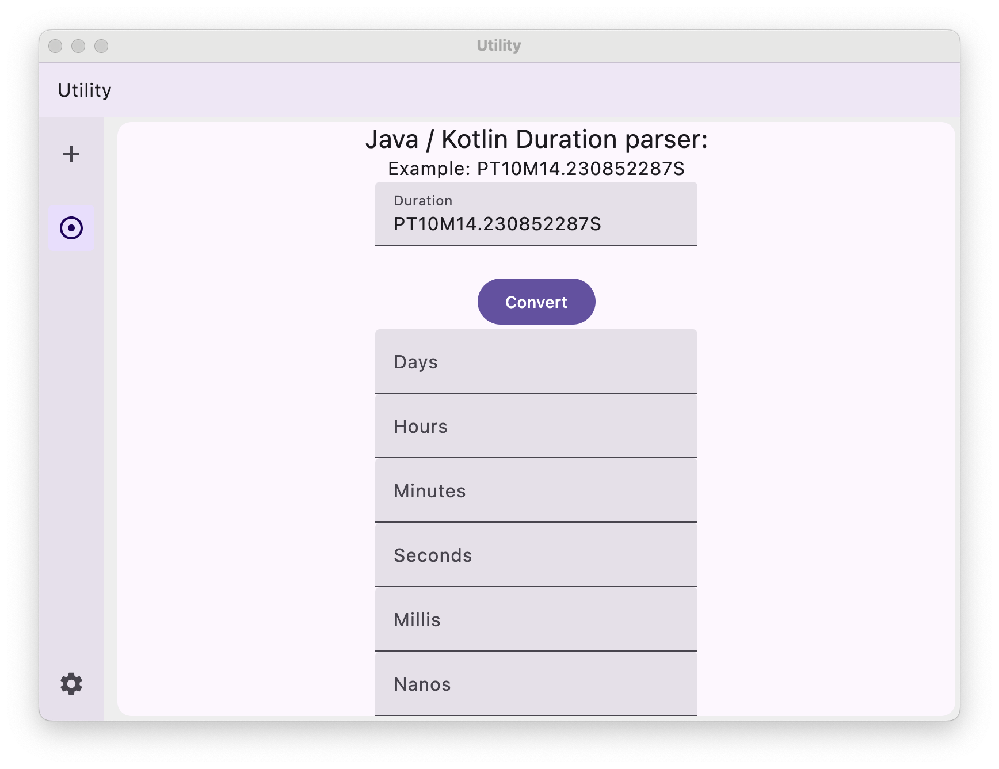

# Utility-Kotlin

<!--  -->

> Utility app built in Kotlin

## Site

- https://alex-hedley.github.io/Utility-Kotlin/

## Features

- Duration Parser
<!-- - HTML Encode/Decode #8 -->
- URL Encode #9
<!-- - HEX to RGB #10 -->
<!-- - SQL Builder (IN Clause) #11 -->
- Guid #12
<!-- - JSON Pretty #13 -->
<!-- - XML Pretty #14 -->
<!-- - SQL Formatter #15 -->
  <!-- - SQL LIKE -->
  <!-- - SQL IN - Filter Duplicates -->
<!-- - Remove whitespace #16 -->
<!-- - String Convert #17 -->
<!-- - Diff #18 -->
<!-- - Binary #19 -->
<!-- - Epoch Converter #20 -->
<!-- - Ascii Checker #21 -->
<!-- - kb - mb - gb converter #22 -->
<!-- - time converter #23 -->
<!-- - MD5 #24 -->
<!-- - Hidden Character Finder #25 -->
<!-- - Luhn Checker #26 -->
<!-- - Unicode #27 -->
<!-- - String Tools - Regular Expression #35 -->
- String Tools - Base64 Encode/Decode #36
<!-- - TOTP Token Generator #38 -->
<!-- - HEX to DEC #39 -->
<!-- - SQL Formatter - Contains #41 -->

[Progress](docs/PROGRESS.md)

## src

- [src](src/README.md)

Initial app template built from https://kmp.jetbrains.com/?web=true&includeTests=true

## Docs

- [Docs](docs/README.md)
- [Deployment](docs/DEPLOYMENT.md)

## Related

- https://alexhedley.com/Utility/
  - https://alexhedley.github.io/Utility-Web/
  - https://alexhedley.github.io/Utility-Blazor/
